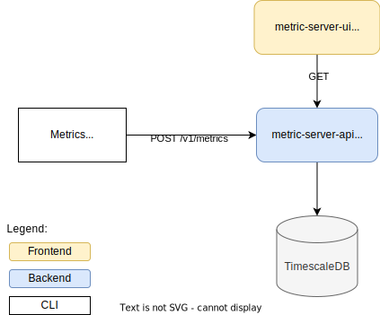

# Metrics Server

This project is a metrics server composed by the `metrics-server-api` (backend) and the `metrics-server-ui` (frontend).

The `metrics-server-api` exposes the API to ingest metrics and to consume aggregated metrics per granularity.

The `metrics-server-ui` shows a chart of the aggregated data.

Bonus: there is a `simulator` (CLI tool) to send multiple metrics concurrently (20 metrics every 300 ms).

✨ You can watch my [3 minutes video demo](https://www.loom.com/share/ca3510d169bb4eb992bdf980c3c2a309) of the project!

## Specification #3 (better for senior)

> We need a Frontend + Backend application that allows you to post and visualize metrics.
> Each metric will have: Timestamp, name, and value. The metrics will be shown in a timeline and must show averages per minute/hour/day The metrics will be persisted in the database.

## Architecture



## Project Structure

```
.
├── docs
├── metrics-server-api <-- backend / simulator
└── metrics-server-ui  <-- frontend
```

## Documentation

You can find the documentation of each project (backend and frontend) on its own README.md files:
- [`metrics-server-ui` (frontend)](metrics-server-ui/README.md)
- [`metrics-server-api` (backend)](metrics-server-api/README.md)

## Getting Started

### Build and run with docker

You can run the frontend, backend and the database using Docker Compose

  ```bash
  docker-compose up -d
  ```

  Check if services are up and running
  ```bash
  docker-compose ps
  ```

  You should be able see something like:

  ```
  NAME                             IMAGE                                 COMMAND                  SERVICE              CREATED         STATUS         PORTS
  metrics-server-api               metrics_server-metrics-server-api   "/bin/sh -c '/wait &…"   metrics-server-api   2 minutes ago   Up 4 seconds   3000/tcp, 0.0.0.0:8080->8080/tcp
  metrics-server-ui                metrics_server-metrics-server-ui    "docker-entrypoint.s…"   metrics-server-ui    2 minutes ago   Up 2 minutes   0.0.0.0:3000->3000/tcp
  metrics_server-timescaledb-1   timescale/timescaledb:latest-pg15     "docker-entrypoint.s…"   timescaledb          2 minutes ago   Up 2 minutes   0.0.0.0:5432->5432/tcp
  ```

#### Sending metrics
  You can post a metric:
  ```
  curl -i -X POST -H "Content-Type: application/json" --data "{\"timestamp\":\"2024-02-02T11:43:02.099Z\", \"name\":\"temperature\",\"value\":30}" http://localhost:8080/v1/metrics
  ```

  Alternatively, you can run the simulator

  ```bash
  docker-compose run simulator
  ```
  It will spam the stdout with the log every second.

  Open [http://localhost:3000](http://localhost:3000) with your browser to see the result.

## Architecture decisions

- As it's a POC, I avoided to introduce a Pub/Sub or Queue system, as Golang could handle efficiently 67 requests per second or 4020 RPMs (using the simulator: 20 Request * 300 ms).
- Golang: I dediced to use Golang as I'm familiar with the programming language and I believe it's a good choice for this kind of challenge in the backend.
- NextJS/Typescript: I decided to use NextJS as it's simple and effective for building simple frontend sites.
- TimescaleDB: I decided to use timescaleDB as it is built on top of PostgreSQL and supports timeseries queries.

### Next steps if requires more scalability
- It can be scaled horizontally and add an Pub/Sub or Queue to offload the database writting and process metrics asynchronously
- Add a readonly replica of the database. Split the current database in a writting and readonly databases to remove the competition between the reading and writing operations.

## Disclaimer
- I commited the `.env` file to facilitate to run this project. In real life, I would create a .env.example file instead.


## TODO
Here you can find the tasks that I planned for this project.

Unfortunately, I couldn't do all of them, but you can verify the missing ones.

Backend:
- [X] API to receive the metric (POST)
- [X] Database to store the metric
- [x] API to retrieve the aggregations per minute/hour/day (GET)
- [ ] API Swagger documentation
- [ ] CI/CD
- [ ] Deploy to a cloud provider

Frontend:
- [x] Sparkline chart component
- [x] Filter by:
  - granularity: use for `minute`, `hour` and `day`
  - time frame: use for two different dates including times (hour/min/sec). E.g: "02-02-2024 16:50:00" and "02-02-2024 18:50:00"
- [ ] Write tests for the components and page.
- [ ] CI/CD
- [ ] Deploy to a cloud provider


Producer Simulator (Bonus):
- [x] post a metrics every second or less
